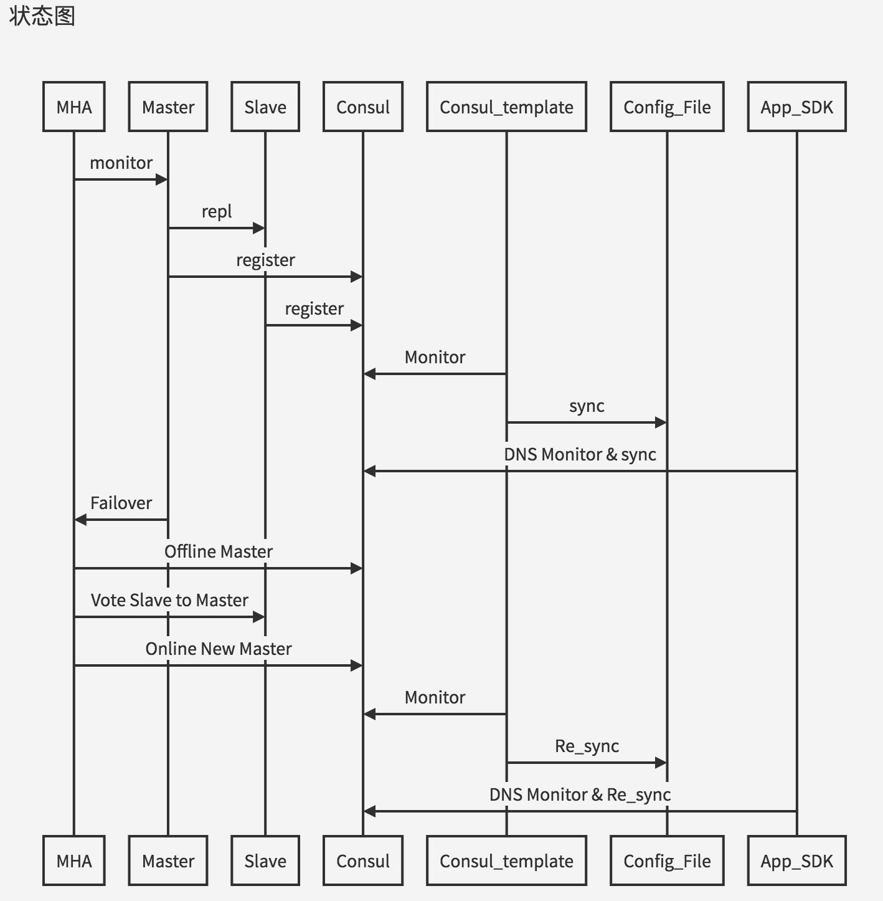

### 组件说明

| 组件 | 作用| 
| --- | --- | 
| MHA |       用于监控主节点,自动或手动进行Failover切换, 或Online无损主从切换|
| Consul |   注册和发布DB的当前部署情况和健康状态|
|Consul Template |将Consul的内容翻译到中间件配置文件或者应用程序的DB的配置文件|
| App_SDK |**应用程序自身** 通过 **DNS** 通过CONSUL并更新自身DB列表|

### 简要说明

* MHA 控制主节点去单点
* Consul 注册和发布信息，类似Zookeeper
* 使用Consul template或者DNS的方式获取Consul集群最新情况

###DB Failover 状态机

###Consul的注册信息格式

| 字段 | 说明 | 举例 |含义 |
| --- | --- | --- | ---|
| name | 服务名 | fanxing_core1 | 一组DB主从,比如繁星核心库1 |
| tag | 标签 | master | 代表主库或者从库 |
| IP | IP | 10.1.1.1 | 代表注册的DB的内网地址 | 
| PORT | PORT | 3306 | 代表注册的DB的端口号 | 
| CHECK | check脚本 & 检测周期 | | 定期启动check脚本 当返回值为0代表健康，返回值为1代表不健康 扩展该脚本的包含磁盘空间，延时情况|

